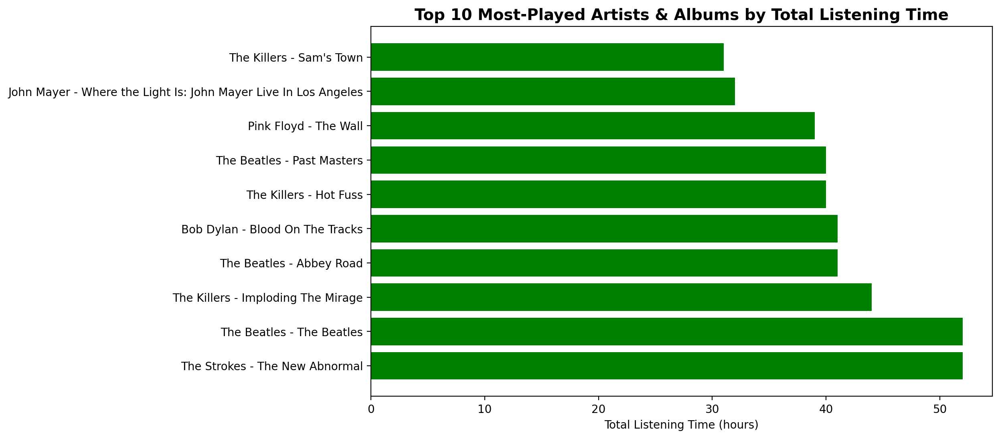
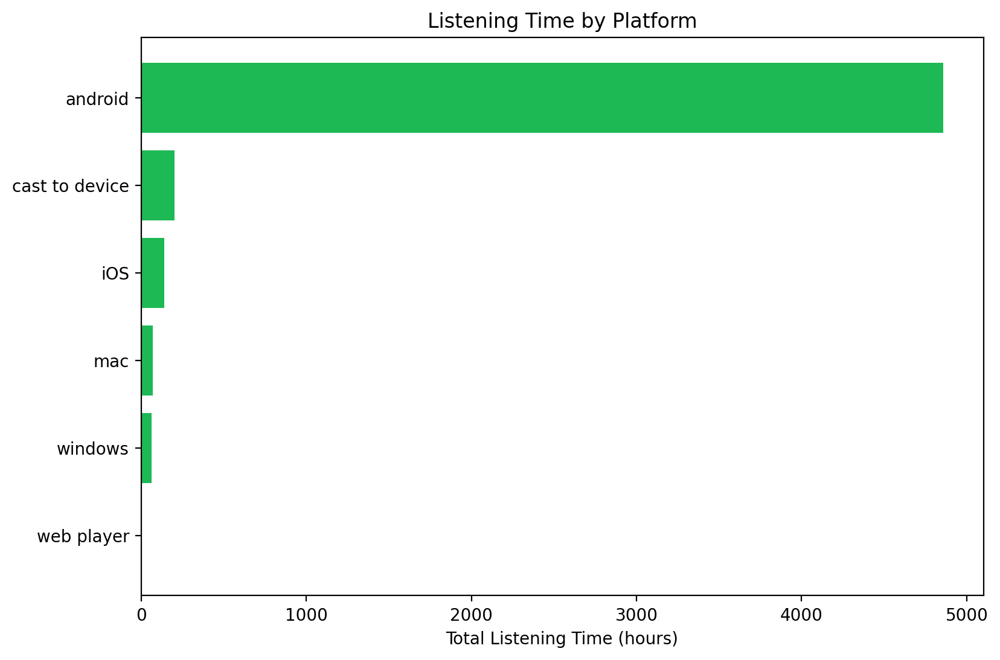
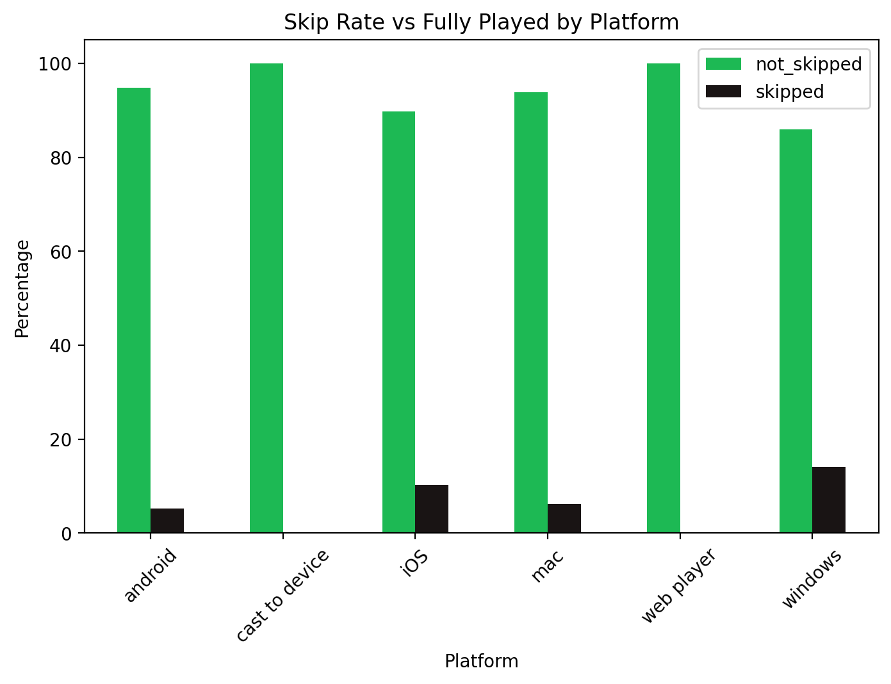
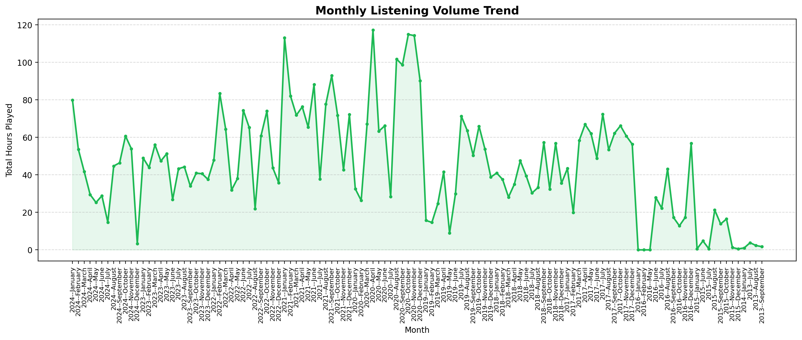
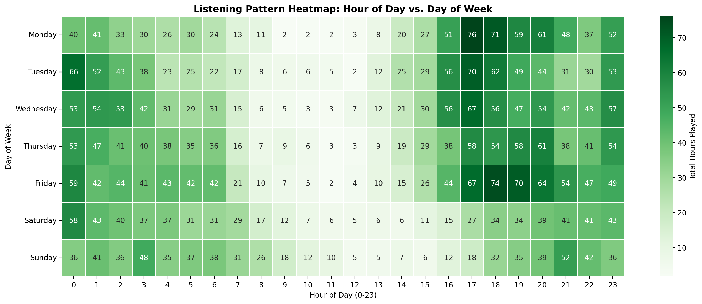
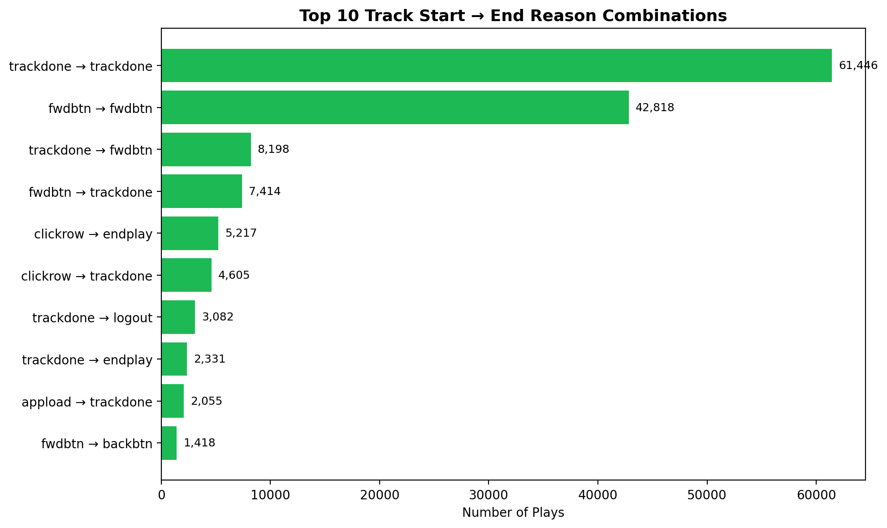
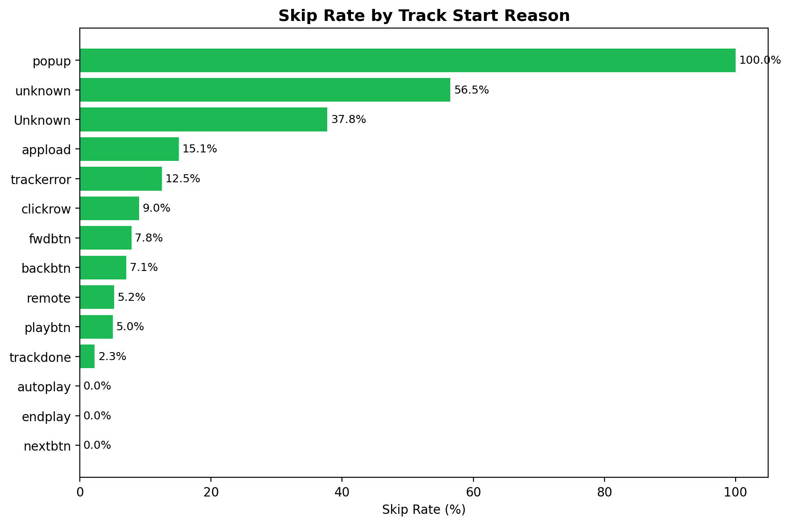
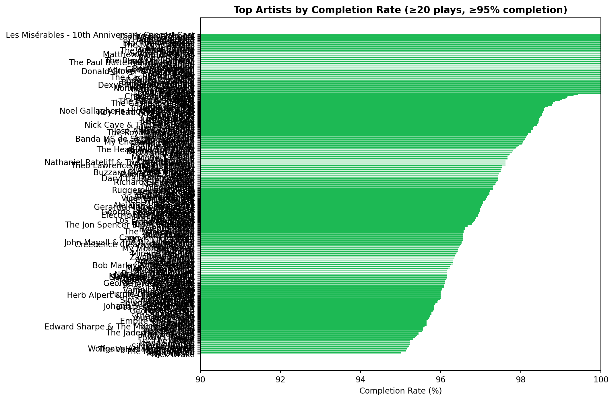
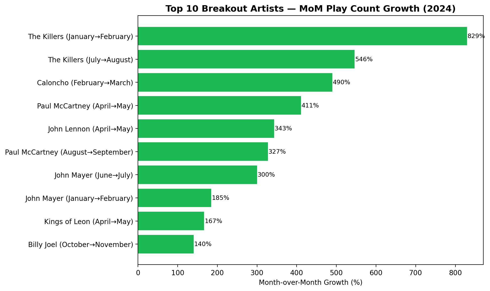
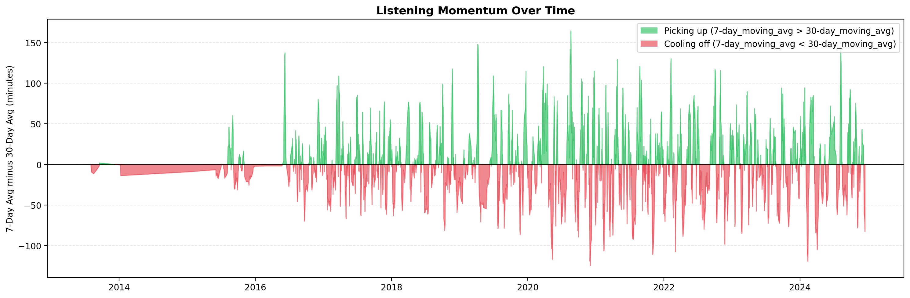

.png)
# 🎧 Spotify Streaming History — SQL Time-Series Analytics Project

## 📌 Project Description
An end-to-end **SQL-based time-series analytics project** on 150K+ Spotify streaming events, uncovering listening trends, platform behavior, skip patterns, and artist growth using advanced SQL (window functions, CTEs, sessionization logic) and Python data visualization. Built to simulate a real-world **Data Analyst** workflow — from raw event logs to business-ready insights and dashboards.

## 💡 Why This Project Matters for the Analytics Industry
Streaming, e-commerce, and product companies rely on **time-series behavioral data** (clickstream, sessions, engagement logs) to drive retention, personalization, and growth strategy. This project demonstrates the exact analytical toolkit used in industry — trend analysis, cohort/momentum tracking, rolling averages, and skip/engagement metrics — the same techniques applied at companies like Spotify, Netflix, and YouTube to reduce churn and optimize user experience.

## 🛠️ Tech Stack
- **Database:** MySQL 8.0 (Window Functions, CTEs, Subqueries)
- **Data Connectivity:** SQLAlchemy, PyMySQL, mysql-connector-python
- **Language:** Python 3.13
- **Data Manipulation:** Pandas
- **Visualization:** Matplotlib, Seaborn
- **Environment:** Jupyter Notebook
- **Version Control:** Git & GitHub

## 📂 Repository Structure
```
├── images/                                 # Chart screenshots (referenced below)
├── Spotify_timeseries_analysis_sql.sql     # All 10 SQL queries
├── SPOTIFY_SQL_VISUALIZATION.ipynb         # Python analysis & visualizations
├── spotify_history.csv                     # Raw dataset
├── spotify_data_dictionary.csv             # Column definitions
└── README.md
```

---

## 📊 Analysis, Insights & Visualizations

### Q1. What are the top 10 most-played artist/album combinations by total listening time?
**Difficulty:** Easy
**SQL Technique:** `GROUP BY`, `SUM()`, `ORDER BY`, `LIMIT`

```sql
SELECT artist_name, album_name, 
       ROUND((SUM(ms_played)/1000)/3600) AS total_listening_time_hour 
FROM spotify.spotify_history 
GROUP BY album_name, artist_name 
ORDER BY total_listening_time_hour DESC 
LIMIT 10;
```

**Insight:** Identifies the highest-engagement content, useful for retention and recommendation strategy.



---

### Q2. What is the distribution of streams across platforms?
**Difficulty:** Easy
**SQL Technique:** `SUM() OVER()`, ratio-to-total calculation

```sql
SELECT *, ROUND(total_listening_time_hour*100.0/SUM(total_listening_time_hour) OVER(), 2) AS percent
FROM (
    SELECT platform, ROUND((SUM(ms_played)/1000)/3600) AS total_listening_time_hour   
    FROM spotify.spotify_history 
    GROUP BY platform 
    ORDER BY total_listening_time_hour DESC
) t;
```

**Insight:** Reveals platform dependency (e.g., mobile-first usage), guiding product and engineering investment priorities.



---

### Q3. What percentage of tracks were skipped vs. fully played, and how does this vary by platform?
**Difficulty:** Easy–Medium
**SQL Technique:** `CASE WHEN`, `SUM() OVER(PARTITION BY)`

```sql
SELECT platform, skipped, 
       ROUND(total*100.0/SUM(total) OVER(PARTITION BY platform), 2) AS percentage 
FROM (
    SELECT platform, skipped, COUNT(*) AS total 
    FROM spotify.spotify_history 
    GROUP BY skipped, platform
) t;
```

**Insight:** Flags platforms with poor content-fit or UX friction, where users are more likely to disengage.



---

### Q4. How has monthly listening volume trended over the years?
**Difficulty:** Medium
**SQL Technique:** `YEAR()`, `MONTH()`, time-based aggregation

```sql
SELECT CONCAT(year_, '-', LPAD(month_num, 2, '0')) AS year_month_,
       ROUND(SUM(ms_played)/3600000.0, 2) AS total_played_hour
FROM (
    SELECT *, YEAR(ts) AS year_, MONTH(ts) AS month_num
    FROM spotify.spotify_history
) t
GROUP BY year_, month_num
ORDER BY year_, month_num;
```

**Insight:** Tracks long-term engagement growth or decline — a core business health metric for subscription platforms.



---

### Q5. What is the listening pattern by hour-of-day and day-of-week?
**Difficulty:** Medium
**SQL Technique:** `HOUR()`, `DAYOFWEEK()`, pivoting for heatmap

```sql
SELECT day_, time_of_the_day, ROUND(SUM(ms_played)/3600000.0, 2) AS total_listen_hour
FROM (
    SELECT *, DAYNAME(ts) AS day_, HOUR(ts) AS time_of_the_day 
    FROM spotify.spotify_history
) t 
GROUP BY time_of_the_day, day_ 
ORDER BY day_, time_of_the_day;
```

**Insight:** Surfaces peak usage windows, useful for scheduling push notifications and new release timing.



---

### Q6. What is the most common "track start reason" and "track end reason" combination?
**Difficulty:** Medium
**SQL Technique:** Multi-column `GROUP BY`

```sql
SELECT reason_start, reason_end, COUNT(*) AS total_count 
FROM spotify.spotify_history 
GROUP BY reason_start, reason_end 
ORDER BY total_count DESC 
LIMIT 10;
```

**Insight:** Explains the dominant playback behavior pattern (e.g., autoplay-driven vs. manual track selection).



---

### Q7. How does skip rate differ by reason_start (autoplay, clickrow, shuffle, etc.)?
**Difficulty:** Medium
**SQL Technique:** Conditional aggregation with `CASE WHEN`

```sql
SELECT reason_start,
       COUNT(*) AS total_plays,
       SUM(CASE WHEN skipped = TRUE THEN 1 ELSE 0 END) AS skipped_count,
       ROUND(SUM(CASE WHEN skipped = TRUE THEN 1 ELSE 0 END) * 100.0 / COUNT(*), 2) AS skip_rate_pct
FROM spotify.spotify_history
GROUP BY reason_start
ORDER BY skip_rate_pct DESC;
```

**Insight:** Diagnoses which content-discovery mechanism (autoplay vs. active selection) drives the most disengagement.



---

### Q8. What is the completion (non-skip) rate by artist?
**Difficulty:** Medium–Hard
**SQL Technique:** `HAVING`, sample-size thresholding to avoid statistical noise

```sql
SELECT * 
FROM (
    SELECT artist_name, COUNT(*) AS total_song,
           ROUND(SUM(CASE WHEN skipped=0 THEN 1 ELSE 0 END)*100.0/COUNT(*), 2) AS completion_rate 
    FROM spotify.spotify_history 
    GROUP BY artist_name 
    HAVING COUNT(*) > 20
) t 
WHERE completion_rate >= 95 
ORDER BY completion_rate DESC, total_song DESC
LIMIT 20;
```

**Insight:** Ranks the "stickiest" artist content, filtered for minimum play count to avoid small-sample bias.



---

### Q9. Which artists are trending up the fastest month-over-month (breakout artists) in 2024?
**Difficulty:** Hard
**SQL Technique:** `LAG() OVER (PARTITION BY)`, month-over-month % growth calculation

```sql
SELECT * 
FROM (
    SELECT artist_name, month_name, last_month_name,
           ROUND((total_play_count - last_month_total_play) * 100.0 / last_month_total_play, 2) AS MONTH_OVER_MONTH_GROWTH_PERCENT
    FROM (
        SELECT *,
               LAG(month_no) OVER (PARTITION BY artist_name ORDER BY month_no) AS last_month_no,
               LAG(month_name) OVER (PARTITION BY artist_name ORDER BY month_no) AS last_month_name,
               LAG(total_play_count) OVER (PARTITION BY artist_name ORDER BY month_no) AS last_month_total_play
        FROM (
            SELECT artist_name, month_name, month_no, COUNT(*) AS total_play_count
            FROM (
                SELECT ts, artist_name, MONTH(ts) AS month_no, MONTHNAME(ts) AS month_name 
                FROM spotify.spotify_history 
                WHERE ts >= '2024-01-01' AND ts < '2025-01-01'
            ) t 
            GROUP BY artist_name, month_name, month_no
        ) p
    ) g 
    WHERE (month_no - last_month_no) = 1
) c
WHERE last_month_total_play >= 5
ORDER BY MONTH_OVER_MONTH_GROWTH_PERCENT DESC
LIMIT 10;
```

**Insight:** Detects emerging listening trends — mirrors real-world growth/marketing analytics used to spot breakout products.



---

### Q10. Rolling 7-day & 30-day moving average of daily listening time, with trend crossover detection
**Difficulty:** Hard
**SQL Technique:** `AVG() OVER (ROWS BETWEEN ... PRECEDING)`, `LAG()`, state-comparison logic (gaps & islands)

```sql
WITH daily AS (
    SELECT DATE(ts) AS date_, ROUND(SUM(ms_played)/60000.0, 2) AS total_listen_min
    FROM spotify.spotify_history
    GROUP BY DATE(ts)
),
rolling AS (
    SELECT *,
        AVG(total_listen_min) OVER(ORDER BY date_ ROWS BETWEEN 6 PRECEDING AND CURRENT ROW) AS MOVING_AVG_7_DAYS,
        AVG(total_listen_min) OVER(ORDER BY date_ ROWS BETWEEN 29 PRECEDING AND CURRENT ROW) AS MOVING_AVG_30_DAYS
    FROM daily
),
trend AS (
    SELECT *,
        CASE WHEN MOVING_AVG_7_DAYS > MOVING_AVG_30_DAYS THEN 'ABOVE' ELSE 'BELOW' END AS TREND_STATUS
    FROM rolling
),
with_lag AS (
    SELECT date_, MOVING_AVG_7_DAYS, MOVING_AVG_30_DAYS, TREND_STATUS,
        LAG(TREND_STATUS) OVER(ORDER BY date_) AS PREVIOUS_DAY_TREND_STATUS
    FROM trend
),
with_events AS (
    SELECT *,
        CASE 
            WHEN TREND_STATUS='ABOVE' AND PREVIOUS_DAY_TREND_STATUS='BELOW' THEN 'Picking up'
            WHEN TREND_STATUS='BELOW' AND PREVIOUS_DAY_TREND_STATUS='ABOVE' THEN 'Cooling_off'
            ELSE 'NO'
        END AS CROSSOVER_EVENT
    FROM with_lag
)
SELECT * FROM with_events
WHERE CROSSOVER_EVENT IN ('Cooling_off', 'Picking up');
```

**Insight:** Smooths daily noise to reveal genuine listening habit shifts — the same moving-average crossover technique used in trend/momentum analysis across finance and product analytics.



---

## 🎯 Key Learnings
Strengthened hands-on expertise in **advanced SQL window functions (`LAG`, `AVG() OVER`, `ROWS BETWEEN`), CTE-based query architecture, and translating raw time-series data into decision-ready visual insights** — while learning to prioritize statistical validity (sample-size thresholds, edge-case handling) over surface-level metrics.

## 🔑 Skills Demonstrated *(ATS Keywords)*
`SQL` · `MySQL` · `Window Functions` · `CTE (Common Table Expressions)` · `Subqueries` · `Time-Series Analysis` · `Data Aggregation` · `Cohort Analysis` · `Trend Analysis` · `Moving Average` · `Data Cleaning` · `Python` · `Pandas` · `Data Visualization` · `Matplotlib` · `Seaborn` · `Exploratory Data Analysis (EDA)` · `Business Intelligence` · `KPI Analysis` · `User Behavior Analytics` · `Data-Driven Decision Making` · `ETL` · `SQLAlchemy`

---
⭐ *If you found this project useful, feel free to star the repo!*
